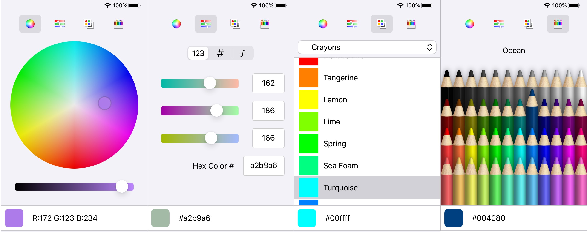

### App Showcase

### Target Image

### The process

- In the project directory, run `npm start`
- Navigate to [http://localhost:3000](http://localhost:3000)
- Let the Page Load
- On the first page Use the wheel to select a color and the slider to change the brightness of the color
- On the second page use the sliders that control red, green, blue respectively to output a color
- On the third page click on a color from a list of colors that css supports to get the color

